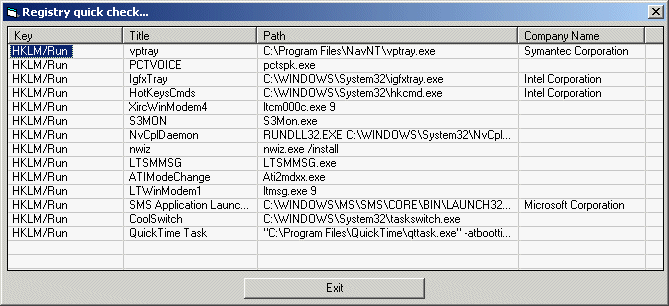



## Find those 'undetectable start up' applications\!

### Description

There are several registry locations that applications can be started from before the desktop is presented. They are 'detectable' and this application will help you locate them and their owner companies. Run this regularly and familiarise yourself with what does start up in your machine. pretty soon, you'll very quickly recognise when a new thing appears - it could be a virus!!
 
### More Info
 

             |
---                |---
**Submitted On**   |2003-07-08 08:34:42
**By**             |[Fosters](https://github.com/Planet-Source-Code/PSCIndex/blob/master/ByAuthor/fosters.md)
**Level**          |Intermediate
**User Rating**    |4.0 (12 globes from 3 users)
**Compatibility**  |VB 5\.0, VB 6\.0
**Category**       |[Complete Applications](https://github.com/Planet-Source-Code/PSCIndex/blob/master/ByCategory/complete-applications__1-27.md)
**World**          |[Visual Basic](https://github.com/Planet-Source-Code/PSCIndex/blob/master/ByWorld/visual-basic.md)
**Archive File**   |[Find\_those1701301292004\.zip](https://github.com/Planet-Source-Code/fosters-find-those-undetectable-start-up-applications__1-51347/archive/master.zip)

